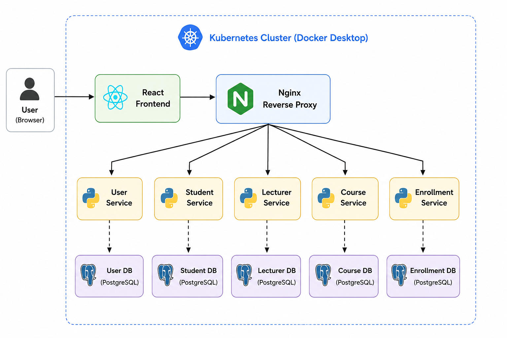

# Week 05 – Example 1: Kubernetes Deployment of a Microservices Application

## Objective

The objective of this example is to deploy a containerized microservices application to a Kubernetes cluster using Docker Desktop Kubernetes. Students will build upon the Docker Compose deployment completed in the previous week by learning how to deploy, manage, and verify a distributed application using Kubernetes.

The application consists of multiple FastAPI microservices, each with its own PostgreSQL database, and a React frontend that communicates with the backend services through an Nginx reverse proxy. Students will deploy each component as Kubernetes Deployments and Services, configure application Secrets, and verify communication between all services.

By completing this example, students will gain practical experience deploying cloud-native applications with Kubernetes and understand how container orchestration extends the concepts introduced with Docker Compose.

## Learning Outcomes

By completing this example, you will be able to:

* Deploy a multi-container microservices application to a Kubernetes cluster.
* Create and manage Kubernetes Deployments for application and database containers.
* Configure Kubernetes Services to enable communication between microservices.
* Store and manage application configuration using Kubernetes Secrets.
* Understand service discovery and internal networking in Kubernetes.
* Verify application deployments using Kubernetes commands.
* Test a distributed application deployed on Kubernetes.
* Compare Docker Compose and Kubernetes deployment approaches.

## System Architecture

The application follows a microservices architecture, where each service is independently deployed and manages its own PostgreSQL database. A React frontend provides the user interface and communicates with the backend services through an Nginx reverse proxy. This approach provides a single entry point for client requests while allowing each backend service to remain independently deployable.

The application consists of the following components:

* **React Frontend** – Provides the web-based user interface for interacting with the application.
* **Nginx Reverse Proxy** – Routes frontend API requests to the appropriate backend microservice.
* **User Service** – Manages user authentication and authorization.
* **Student Service** – Manages student records and profile information.
* **Lecturer Service** – Manages lecturer records and profile information.
* **Course Service** – Manages course information.
* **Enrollment Service** – Manages student enrolments.
* **PostgreSQL Databases** – Each microservice has its own dedicated PostgreSQL database, following the database-per-service design pattern.





## Prerequisites

Before running this example, ensure the following software is installed and configured on your computer:

* Docker Desktop with Kubernetes enabled
* Python 3.12 or later
* Git
* Visual Studio Code (or another code editor)
* kubectl command-line tool

To verify your installation, run the following commands:

```bash
docker --version
docker compose version
kubectl version --client
python --version
git --version
```

If all commands return version information without errors, your development environment is ready for this example.


## Running Unit Tests

Before deploying the application, verify that each microservice is functioning correctly by running its unit tests. Repeat the following steps for each microservice:

* `user-service`
* `student-service`
* `lecturer-service`
* `course-service`
* `enrollment-service`

### Step 1: Navigate to the Microservice Directory

```bash
cd user-service
```

### Step 2: Create a Python Virtual Environment

```bash
# Create the virtual environment
python -m venv .venv

# Activate the virtual environment
# On macOS/Linux:
source ./.venv/bin/activate

# On Windows (Command Prompt):
# .\.venv\Scripts\activate.bat

# On Windows (PowerShell):
# .\.venv\Scripts\Activate.ps1
```

### Step 3: Install the Required Packages

```bash
pip install -r requirements.txt
```

### Step 4: Execute the Unit Tests

```bash
pytest
```

Repeat the above steps for each of the remaining microservices. Ensure that all tests pass successfully before proceeding to the Docker Compose deployment.


## Running the Application with Docker Compose

Before deploying the application to Kubernetes, verify that the complete system is functioning correctly using Docker Compose.

### Step 1: Navigate to the Project Directory

```bash
cd week05/example-1
```

### Step 2: Build the Docker Images

Build the Docker images for all application services.

```bash
docker compose build
```

### Step 3: Start the Application

Start all application containers in detached mode.

```bash
docker compose up -d
```

### Step 4: Verify the Running Containers

Confirm that all containers are running successfully.

```bash
docker ps
```

You should see the following containers:

* frontend
* user-service
* student-service
* lecturer-service
* course-service
* enrollment-service
* user-db
* student-db
* lecturer-db
* course-db
* enrollment-db

### Step 5: Access the Application

Open the application in your web browser.

```text
http://localhost:5173
```

Verify that the frontend loads successfully and that you can access the application without any errors.

### Step 6: Stop the Application

When you have finished testing the application, stop and remove the containers.

```bash
docker compose down
```

## Running the Application with Kubernetes

This section demonstrates how to deploy the complete microservices application to a Kubernetes cluster using Docker Desktop Kubernetes.

### Step 1: Enable Kubernetes

Open **Docker Desktop**, navigate to **Settings > Kubernetes**, ensure Kubernetes is enabled, and wait until the cluster status changes to **Running**.

Verify that Kubernetes is running by executing:

```bash
kubectl cluster-info
```

### Step 2: Deploy the Application

Apply all Kubernetes manifests.

```bash
kubectl apply -f kubernetes/
```

### Step 3: Verify the Deployment

Verify that all Pods are running successfully.

```bash
kubectl get pods
```

Verify that all Services have been created successfully.

```bash
kubectl get services
```

Wait until all Pods have a **Running** status before proceeding.

### Step 4: Access the Application

Open the application in your web browser.

```text
http://localhost:30080
```

Verify that the frontend loads successfully and that all application features are functioning correctly.

### Step 5: Delete the Deployment

When you have finished testing the application, remove all Kubernetes resources.

```bash
kubectl delete -f kubernetes/
```