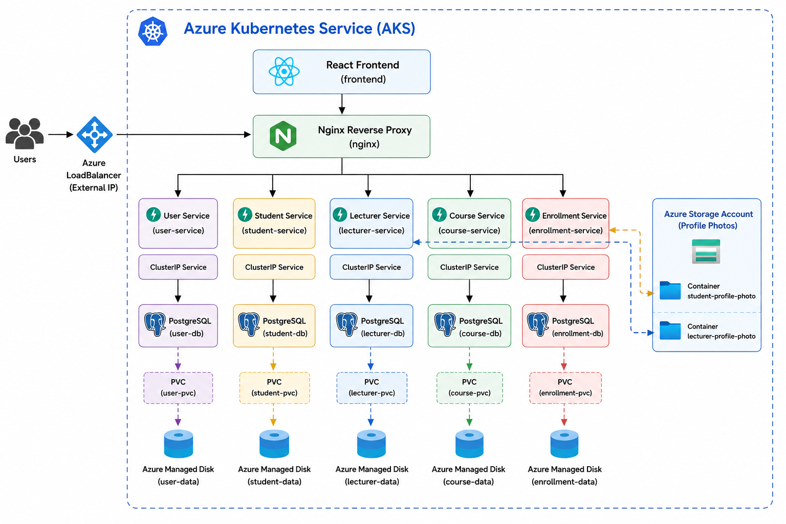

# Week 05 – Example 2: Deploying a Microservices Application to Azure Kubernetes Service (AKS)

## Objective

In this example, you will deploy the KoalaTech University microservices application to Azure Kubernetes Service (AKS). The application consists of multiple FastAPI microservices, individual PostgreSQL databases, an Nginx reverse proxy, and a React frontend.

You will build Docker images, push them to Azure Container Registry (ACR), deploy the application to an AKS cluster using Kubernetes manifests, and verify that all services are running successfully. This example demonstrates how Kubernetes applications developed locally can be deployed to a managed cloud Kubernetes platform with minimal application code changes.

## Learning Outcomes

After completing this example, you will be able to:

- Build Docker images for a multi-service application.
- Push Docker images to Azure Container Registry (ACR).
- Configure Azure Kubernetes Service (AKS) to pull container images from Azure Container Registry.
- Deploy a multi-service application to Azure Kubernetes Service using Kubernetes manifests.
- Provision persistent storage for PostgreSQL databases using Persistent Volume Claims (PVCs).
- Expose a React frontend through an Azure LoadBalancer service.
- Verify the health and status of Kubernetes resources using `kubectl`.
- Troubleshoot common AKS deployment issues, including image pull failures, persistent storage configuration, and pod scheduling errors.
- Access the deployed application using the external IP address assigned by Azure LoadBalancer.


## System Architecture

The application is deployed to **Azure Kubernetes Service (AKS)** and consists of six application components and five PostgreSQL databases. Each microservice has its own dedicated database to ensure service isolation and independent data management.

The React frontend communicates with an Nginx reverse proxy, which routes incoming requests to the appropriate backend microservice using Kubernetes ClusterIP services. All backend services communicate with their respective PostgreSQL databases through the Kubernetes internal network. Each database stores its data on an Azure managed disk using a Persistent Volume Claim (PVC), ensuring data persists even if a pod is restarted.

The frontend is exposed externally using a Kubernetes **LoadBalancer** service, allowing users to access the application through the public IP address assigned by Azure.

> **Architecture Diagram**
>
> 


## Prerequisites

Before running this example, ensure the following software is installed and configured on your computer:

* Docker Desktop with Kubernetes enabled
* Python 3.12 or later
* Git
* Visual Studio Code (or another code editor)
* kubectl command-line tool

To verify your installation, run the following commands:

```bash
docker --version
docker compose version
kubectl version --client
python --version
git --version
```

If all commands return version information without errors, your development environment is ready for this example.

## Create Azure Resources

### Step 1: Create the Azure Storage Account

Create an Azure Storage Account by following the process demonstrated during the seminar.

Once the storage account has been created, create the following Blob Storage containers:

- `student-profile-photo`
- `lecturer-profile-photo`

After creating the containers, obtain the storage account connection string.


## Running Unit Tests

Before deploying the application, verify that each microservice is functioning correctly by running its unit tests. Repeat the following steps for each microservice:

* `user-service`
* `student-service`
* `lecturer-service`
* `course-service`
* `enrollment-service`

### Step 1: Navigate to the Microservice Directory

```bash
cd week05/example-2/user-service
```

### Step 2: Create a Python Virtual Environment

```bash
# Create the virtual environment
python -m venv .venv

# Activate the virtual environment
# On macOS/Linux:
source ./.venv/bin/activate

# On Windows (Command Prompt):
# .\.venv\Scripts\activate.bat

# On Windows (PowerShell):
# .\.venv\Scripts\Activate.ps1
```

### Step 3: Install the Required Packages

```bash
pip install -r requirements.txt
```

### Step 4: Execute the Unit Tests

```bash
pytest
```

Repeat the above steps for each of the remaining microservices. Ensure that all tests pass successfully before proceeding to the Docker Compose deployment.


## Running the Application with Docker Compose

Before deploying the application to Kubernetes, verify that the complete system is functioning correctly using Docker Compose.

### Step 1: Navigate to the Project Directory

```bash
cd week05/example-2
```

### Step 2: Update the Application Configuration

Update the application configuration by adding the Azure Storage connection string to the appropriate environment files.

The following services require the storage connection string:

- `student-service/.env`
- `lecturer-service/.env`

Ensure that the environment variable names match those used by the application.

> **Important:** Do not commit connection strings or other sensitive credentials to the Git repository.

### Step 2: Build the Docker Images

Build the Docker images for all application services.

```bash
docker compose build --no-cache
```

### Step 3: Start the Application

Start all application containers in detached mode.

```bash
docker compose up -d
```

### Step 4: Verify the Running Containers

Confirm that all containers are running successfully.

```bash
docker ps
```

You should see the following containers:

* frontend
* user-service
* student-service
* lecturer-service
* course-service
* enrollment-service
* user-db
* student-db
* lecturer-db
* course-db
* enrollment-db

### Step 5: Access the Application

Open the application in your web browser.

```text
http://localhost:5173
```

Verify that the frontend loads successfully and that you can access the application without any errors.

### Step 6: Stop the Application

When you have finished testing the application, stop and remove the containers.

```bash
docker compose down
```

## Running the Application on Azure Kubernetes Service (AKS)

### Step 1: Create an Azure Kubernetes Service (AKS) Cluster

Create an Azure Kubernetes Service (AKS) cluster by following the steps demonstrated during the seminar.

Once the cluster has been created, verify that it is running successfully before proceeding to the next step.

### Step 2: Create an Azure Container Registry (ACR)

Create an Azure Container Registry (ACR) using the process covered in the previous weeks.

Ensure that the registry is created successfully before continuing.

### Step 3: Build Docker Images

Build Docker images for all application components using the provided `docker-compose.yml` file.

Verify that all images have been created successfully.

### Step 4: Push Docker Images to Azure Container Registry

Tag and push all Docker images to your Azure Container Registry.

After pushing the images, verify that they are available in your ACR repository.

### Step 5: Connect AKS to Azure Container Registry

Configure your AKS cluster so that it can pull container images from your Azure Container Registry.

Verify that the connection has been established successfully.

### Step 6: Connect to the AKS Cluster

Configure `kubectl` to communicate with your AKS cluster.

Verify that the cluster is accessible and that the worker node(s) are in the **Ready** state.

### Step 7: Update the Kubernetes Application Secret

Before deploying the application to Local Kubernetes, update the Kubernetes application secret file (`07-application-secret.yaml`) with the Azure Storage connection string.

Ensure that the storage connection string is added to the appropriate Kubernetes Secret so that the `student-service` and `lecturer-service` can access Azure Blob Storage.

Verify that the environment variable names used in the Kubernetes Secret match those defined in the application.

### Step 8: Update the Kubernetes Manifest Files

Update the Kubernetes deployment manifest files to use the container images stored in your Azure Container Registry (ACR).

Ensure that the image names and tags in each deployment file match the images that were pushed to your ACR before deploying the application to AKS.

> **Note:** Only the application deployment manifests need to be updated. The PostgreSQL database manifests do not require any image changes.

### Step 9: Deploy the Application

Apply all Kubernetes manifest files located in the `kubernetes` directory.

Wait until all deployments, services, persistent volume claims, and pods have been created successfully.

### Step 10: Verify the Deployment

Use `kubectl` commands to verify that:

- All Pods are in the **Running** state.
- All Persistent Volume Claims (PVCs) are **Bound**.
- All Kubernetes Services have been created successfully.
- The frontend LoadBalancer service has been assigned an external IP address.

### Step 11: Access the Application

Open a web browser and navigate to the external IP address assigned to the frontend LoadBalancer service.

Verify that the KoalaTech University application loads correctly and that all microservices are functioning as expected.

### Step 12: Delete the Deployment

When you have finished testing the application, remove all Kubernetes resources.

```bash
kubectl delete -f kubernetes/
```

## Cleaning Up Azure Resources

After completing this practical, delete all Azure resources created for this deployment to avoid unnecessary charges.

This includes:

- Azure Kubernetes Service (AKS) cluster
- Azure Container Registry (ACR)
- Azure Storage Account
- Resource Group (if it was created specifically for this practical)

Verify that all resources have been removed successfully before concluding the practical.